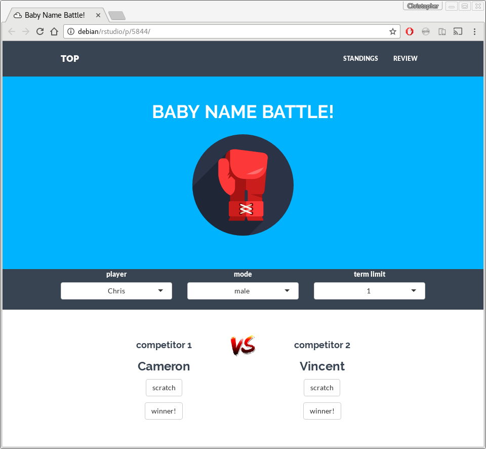
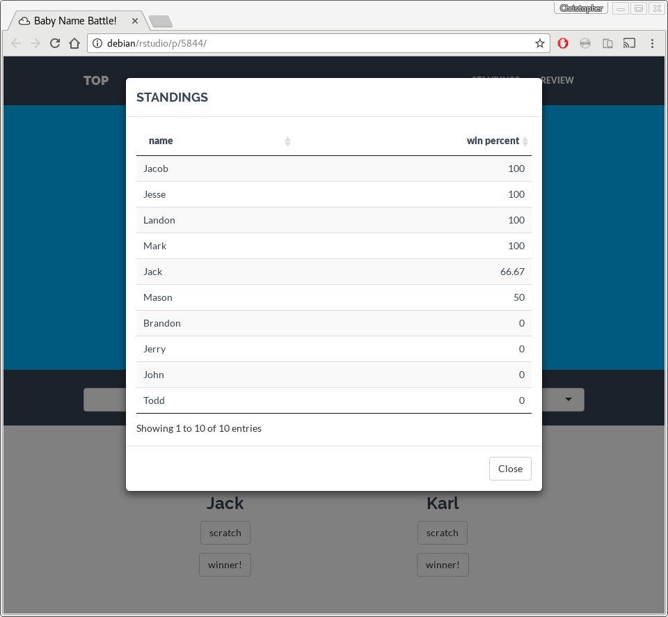
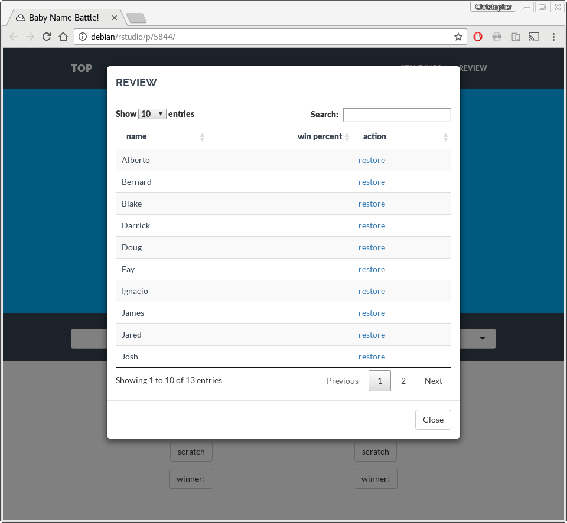

# Baby Name Battle

A very simple `shiny` app I put together as a fun (?) way of helping choose
baby names.







## Installation

The app can be run directly from GitHub:

```R
shiny::runGitHub('cmhh/babynamebattle')
```

Note that the app uses a SQLite database to store the names and results, so
if you want to persist things you need to make a permanent local copy to run.

## Details

The app uses names from the U.S. Census as supplied by the
[hadley/babynames](https://github.com/hadley/babynames) package.  

There is a basic backend stored in `data/battle.db`.  It consists of the
following tables:

* `roster` - list of candidate names
* `battles` - record of all battles
* `scratched` - list of names that have been permanently deleted

The roster is large and the app doesn't provide any useful mechanism for
removing names more than one-by-one.  Bulk deletions can be applied by running
SQL queries against the backend--either by deleting rows from `roster`, or by
appending rows to `scratched`.

Names are chosen randomly with probability relative to popularity.  Popularity
is essentially the relative frequency of a name across time, but weighted
towards more recent years (names from 1880 carry no weight, and names from
2014 carry full weight).
